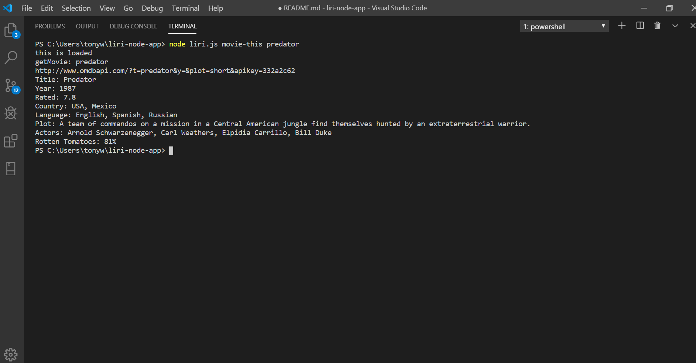
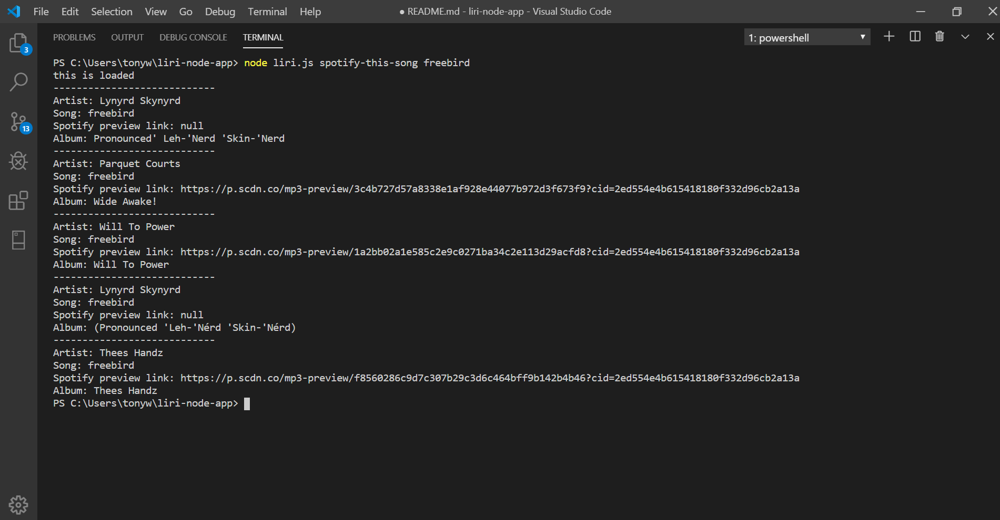
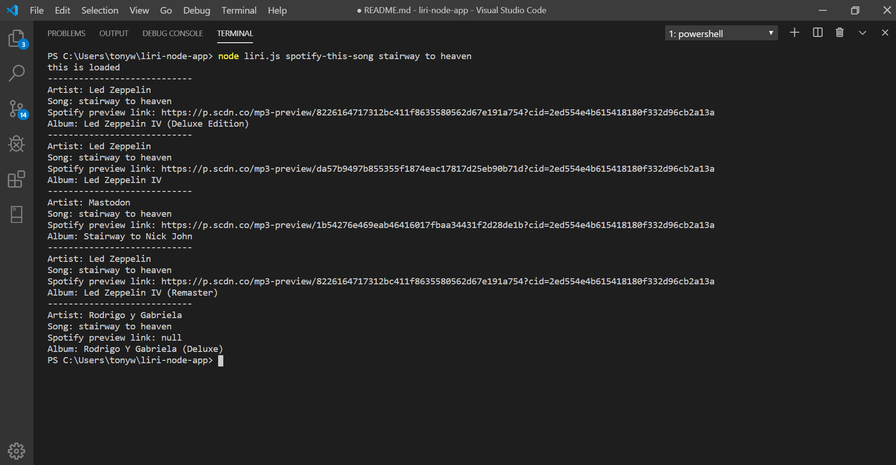
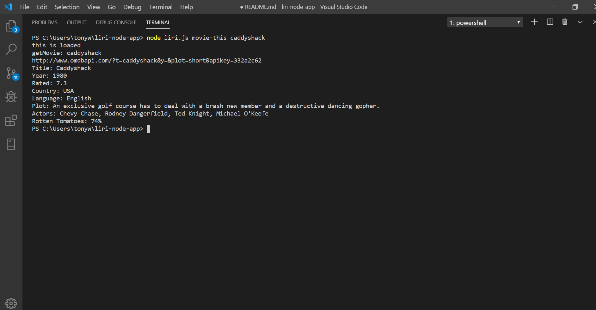
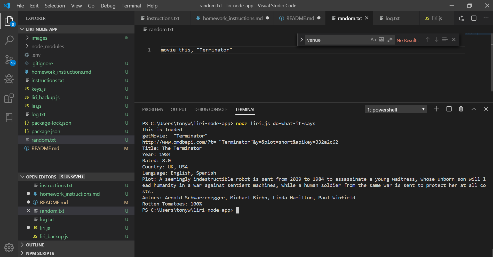

# liri-node-app
Module 10 LIRI-BOT Node Homework
(Language Interpretation and Recognition Interface)

Objective

The assignment is to make LIRI, Language_ Interpretation and Recognition Interface. LIRI will be a command line node app that takes in parameters and gives back data to the CLI.

LIRI is a command line app that takes in several options request parameters and returns data using API calls to retrieve the data.  

API Calls

    spotify-api
    bands-in-town
    omadb_api

Node Modules

    dotenv
    spotify
    axios
    moment.js
    fs

Request Paramters

    concert-this
    spotify-this-song
    movie-this
    do-what-it-says

Screenshots provided demostrates each request parameter.

concert-this ...............

spotify-this-song .....freebird.....

spotify-this-song .....stairway to heaven.....

movie-this......predator...

movie-this.....caddyshack...

do-what-it-says-movie-this.....terminator...

